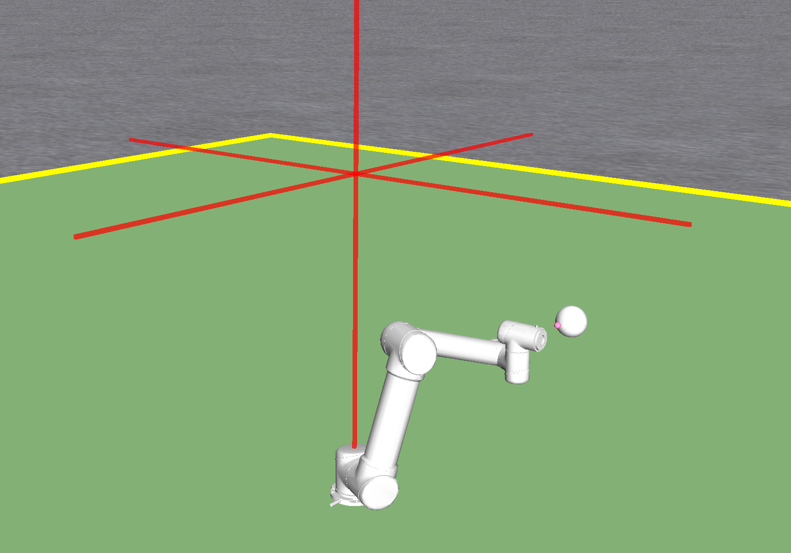
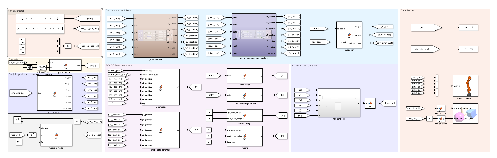

<h1 align="center">
  UR5 Simulink Obstacle MPC
</h1>
<p align="center">
<p align="center">

</p>
## Simulation Environment Requirements
To run the simulation, ensure that you have install visual studio.

Install acado MATLAB interface, you can refer
https://acado.github.io/matlab_overview.html


## Compile the Conrtoller
```
ur5_control_mex_generator.m
```
## Before run the controller
```
ur5_control_startup.m
```
## Open the Simulink and run
```
ur5_simulink_control
```
<p align="center">

</p>

# Change model
If you need to modify the model or controller, be sure to modify or remove the acado_mpc_data.mat file. For convenience during re-runs, some bus size definitions are included in that file.
## BibTeX

If you find this code useful for your research, please consider citing:

```bibtex
@ARTICLE{2024_apf_mpc,
      title={Real-Time Dynamic Obstacle Avoidance for Robot Manipulators Based on Cascaded Nonlinear MPC With Artificial Potential Field}, 
      author={Zhu, Tianqi and Mao, Jianliang and Han, Linyan and Zhang, Chuanlin and Yang, Jun},
      journal={IEEE Transactions on Industrial Electronics}, 
      year={2024},
      volume={71},
      number={7},
      pages={7424-7434},
}
```
